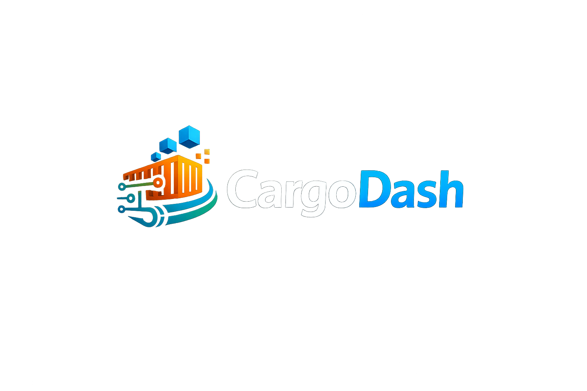

<p align="center">
  
</p>

# CargoDash

> ✅ **正式稳定版本（v1.0.0）。** 自 v1.0.0 起，CargoDash 遵循[语义化版本](https://semver.org/lang/zh-CN/)：`cargodash/__init__.py` 导出的公共 API 在同一大版本内不会发生破坏性变更；破坏性变更只保留给未来的大版本，并提前在 [CHANGELOG.md](CHANGELOG.md) 中公示。

CargoDash 是一个用于搭建**简单、模块化、多功能、高效**的大模型训练数据合成 / 增强流水线的 Python 库。核心理念：任何数据处理流水线都可以由**顺序**与**分支**两类原语嵌套组合而成。

## v1.0.0 新增

- **首个正式稳定版。** 公共 API 自此受[语义化版本](https://semver.org/lang/zh-CN/)兼容性保证约束，详见文首说明。
- **测试套件**：[`tests/`](tests/) 下基于 `unittest` 的测试，覆盖 `Schema`、构图、Pipeline schema 校验、`Processor` / `Judge` / `Vote`、`LLMCall` 以及执行器端到端运行。运行 `python -m unittest discover -s tests` 即可（无需额外依赖）。
- **持续集成**：GitHub Actions 在每次 push 与 PR 上跨 Python 3.10 / 3.11 / 3.12 运行测试。
- **版本号单一来源**：包版本号仅在 `cargodash/__init__.py` 中定义一次，由构建后端动态读取。

## v0.2.3 新增

- **WebUI 远程服务器访问适配**。dev server 配置现已对编辑器端口转发场景做了适配：`base: './'` 让所有资源 URL 走相对路径（同时兼容 `xxx-5173.devtunnels.ms/` 这种根子域名隧道和 `<host>/<...>/proxy/5173/` 这种子路径代理）；`server.allowedHosts: true` 关掉 Vite 5.x 默认的 Host header 校验，避免被机构域名拦截；新增 `preview` 配置块与 `server` 对齐，子路径代理环境下推荐 `npm run build && npm run preview`（取代 `npm run dev`），因为 dev 模式会注入 `/@vite/client` 等 `base` 配置管不到的绝对路径资源，过不了子路径代理。详见 [`webui/README.md`](webui/README.md#remote-server-access)。

## v0.2.2 新增

- **本地模型部署**：除了原有的远程 API 调用，现在可通过 `LocalHFChatClient`（进程内 `transformers`）或 `LocalVLLMChatClient`（CargoDash 拉起 `vllm serve` 子进程、退出时自动回收）跑本地模型。Pipeline 在执行器启动前统一 `open()` 所有 client，多个节点引用同一 client 时框架按对象身份去重，永远只加载一次，避免重复加载把显存撑爆。详见 [模型部署](#模型部署)。
- **WebUI：`ModelSpec` 节点**——一类悬浮于 DAG 之外的节点（类比 `Vote`），声明一次模型，`LLMCall` 通过下拉框引用；导出时 codegen 生成顶层 client 单例变量，天然保证"一次加载，多处共用"。

## v0.2.1 新增

- **WebUI 可视化构图（preview）**：浏览器内拖拽节点、连线、配置参数，一键导出 `pipeline.py`，不会写代码也能搭流水线。详见下方 [WebUI（可视化构图）](#webui可视化构图) 小节。

## v0.2 新增

- **`LLMCall` —— 调模型即一行**：仅需 `prompt + model + api_key`，即可得到一个可塞进 `Processor` 的节点函数；`base_url` 切到 OpenAI 兼容网关（DeepSeek / Moonshot / 智谱 / vLLM / SGLang / Ollama）皆可
- **`ChatClient` 协议层**：抽出 `ChatClient` / `OpenAICompatChatClient` / `MockChatClient`，后续接原生 vLLM、SGLang 协议时只需新增子类
- **`Processor` 简化为单一类**：合并旧 `MapProcessor`，新增 `mode="sample"`（默认）/ `mode="batch"` 两种模式；调 LLM 走 `mode="sample" + intra_batch_workers=N` 并发
- **执行容错修复**：任一节点抛异常时，executor 保证 SENTINEL 推到全部下游 + 进入 drain 模式排空入口队列，不再级联死锁；错误最终原样上抛

## 特性

- **三类核心原语**：`Processor`（顺序处理）、`Judge`（分支判定，支持 sample / batch 两种粒度）、`Vote`（多模型投票，可作为 Judge 的判定函数）
- **`LLMCall` 一行接入大模型**：内置 OpenAI 兼容 client，覆盖 OpenAI / DeepSeek / 智谱 / Moonshot / 通义 / vLLM / SGLang / Ollama 等
- **三种部署方式同一套 API**：远程 OpenAI 兼容服务（`OpenAICompatChatClient`）、进程内 HF（`LocalHFChatClient`）、CargoDash 托管的 vLLM 子进程（`LocalVLLMChatClient`）——一次声明，全 DAG 共用
- **以 batch 为流转单元**：模块之间 streaming 传递 batch，`batch_size = 1` 时自然退化为逐条
- **DAG 用 Python 操作符表达**：`>>` 连接节点，`Judge.on_true / on_false` 命名端口表达分支，汇合点通过对象身份自动识别
- **强类型 Schema**：基于 `pyarrow.Schema`，构图阶段静态校验，分支汇合点 schema 一致性检查同样在构图期完成
- **batch 内并行 + 节点间 streaming + 背压**：`intra_batch_workers` 控制 batch 内多样本并发（典型场景：并发调 LLM），节点间有界队列做 streaming 与 backpressure

## 安装

要求 Python ≥ 3.10。

```bash
# Gitee（国内推荐）
git clone https://gitee.com/the-call-of-volgograd/cargo-dash.git

# 或 GitHub
git clone https://github.com/Berdyanskov/CargoDash.git

cd CargoDash
pip install -e .
```

核心依赖仅 `pyarrow>=15.0`。如需用 `LLMCall` 调真实 OpenAI 兼容服务，再装 `pip install openai`（`MockChatClient` 不需要）。

## 快速上手

下面这段代码搭建了一个含两层嵌套分支、一处汇合的流水线：先用 3 模型投票筛掉低质量样本，再按语言分支决定是否做扩增，最后写出。

```python
from cargodash import (
    Schema, RawDataSource, DataOutput,
    Processor, Judge, Vote, LLMCall, Pipeline,
)

schema = Schema.of(id=int, text=str, quality=float)

source = RawDataSource("in.jsonl", schema=schema, batch_size=32)
target = DataOutput("out.jsonl", schema=schema)

clean = Processor(lambda r: {**r, "text": r["text"].strip()},
                  input_schema=schema, output_schema=schema)

# LLM 调用节点：只需 prompt + 模型名 + api_key，输出会写到 output_field 指定的列。
# 框架在 batch 内按 intra_batch_workers 并发调用，自动覆盖 OpenAI / 国内
# OpenAI 兼容网关（设 base_url）/ 本地 vLLM / SGLang。
augment = Processor(
    LLMCall(
        prompt="改写这句话，使其更生动：{text}",
        model="gpt-4.1-mini",
        api_key="sk-...",
        output_field="text",
        # base_url="https://api.deepseek.com/v1",   # 国内网关示例
        # temperature=0.7, max_tokens=256,           # 任意 gen kwargs 自动转发
    ),
    input_schema=schema, output_schema=schema,
    intra_batch_workers=8,
)

quality_vote = Vote(
    model_list=[model_a, model_b, model_c],   # 任意 callable: dict -> bool
    true_num=2,
)
judge_quality = Judge(quality_vote, granularity="sample",
                      input_schema=schema, intra_batch_workers=4)
judge_lang    = Judge(is_chinese_batch, granularity="batch",
                      input_schema=schema)

# 构图：>> 表示连边，分支必须从 .on_true / .on_false 接出
source >> clean >> judge_quality
judge_quality.on_true  >> judge_lang
judge_lang.on_true     >> augment >> target
judge_lang.on_false    >> target                  # 与上行汇合到同一 target
judge_quality.on_false >> Processor(log_drop, ...)   # log_drop 由你自己写，
                                                     # 例如 def log_drop(row): print(row); return None
                                                     # 返回 None 即丢弃该样本

Pipeline(source).run()
```

完整可运行示例见 [`examples/basic_pipeline.py`](examples/basic_pipeline.py)。

## 模型部署

三种 `ChatClient` 实现都遵循同一份 `chat(messages, **kwargs) -> str` 协议，`LLMCall(client=...)` 任选其一。`Pipeline.run()` 在执行器启动前对所有 client 调 `open()`（任何失败——OOM、未装 vLLM、端口冲突——都会立刻退出），并在 `finally` 中调 `close()`（保证 vLLM 子进程总能被正确回收）：

```python
from cargodash import (
    OpenAICompatChatClient, LocalHFChatClient, LocalVLLMChatClient,
)

# 1) 远程 OpenAI 兼容：OpenAI / DeepSeek / Moonshot / 智谱 / 已起好的 vLLM、SGLang、Ollama 等
remote = OpenAICompatChatClient(model="gpt-4.1-mini", api_key="sk-...")

# 2) 进程内 HF transformers：适合小模型 / 单卡调试
hf = LocalHFChatClient("Qwen/Qwen2.5-1.5B-Instruct",
                       device="cuda", dtype="bfloat16")

# 3) CargoDash 托管的 `vllm serve` 子进程——任何稍大模型推荐走这条路径。
#    open() 起进程并等 /v1/models 探活；close() 优雅终止。
vllm = LocalVLLMChatClient(
    "/share/models/Qwen3.5-397B-A17B",
    tensor_parallel_size=8,
    gpu_memory_utilization=0.9,
    dtype="bfloat16",
)
```

按需安装对应 extras：

```bash
pip install cargodash[openai]      # OpenAICompatChatClient
pip install cargodash[local-hf]    # LocalHFChatClient
pip install cargodash[local-vllm]  # LocalVLLMChatClient
```

两个 `LLMCall` 节点引用同一个 client 对象时框架按对象身份去重——大模型权重不会被加载两次。完整 vLLM 示例见 [`examples/vllm_pipeline.py`](examples/vllm_pipeline.py)。

## WebUI（可视化构图）

如果不想写代码，CargoDash 在 v0.2.1 起提供一套基于浏览器的可视化构图工具：拖拽节点、连线、在右侧面板里填参数 / 写函数，一键导出 `pipeline.py` 即可用 `python pipeline.py` 跑起来。

<p align="center">
  
</p>

**支持的节点**：`RawDataSource` / `DataOutput` / `Processor` / `Judge` / `Vote` / `LLMCall` / `ModelSpec`，与 Python API 一一对应。`Judge` 自带 `on_true` / `on_false` 两个输出端口；`Vote` 与 `ModelSpec` 都不连边——`Vote` 由 `Judge` 在属性面板里引用并在导出时内联到 `Judge(Vote(...), ...)`；`ModelSpec`（kind ∈ remote / local_hf / local_vllm）由 `LLMCall` 在 "client source" 下拉里引用，导出时作为顶层 client 单例变量发射，保证多处共用同一份大模型权重只加载一次。

**用户自定义函数**：`Processor.fn` / `Judge.predicate(code)` / `Vote.model_list[*]` 直接在节点属性面板的 Monaco 编辑器里写 Python，导出时作为顶级 `def` 块前置到生成的 `.py` 中；`LLMCall` 则全部用结构化表单填写。

**工程文件**：`.cdgraph.json` 是图状态的真值，支持导出 / 导入用于二次编辑；`pipeline.py` 是单向导出产物，建议从 `.cdgraph.json` 重新生成而不是手改。

启动方式（需 Node.js ≥ 18）：

```bash
cd webui
npm install
npm run dev          # 浏览器打开 http://localhost:5173
```

**在远程服务器上跑？** 编辑器端口转发给的 URL 如果是 `xxx-5173.<region>.devtunnels.ms/` 这种根子域名（VS Code Tunnels / Cursor），`npm run dev` 直接能跑；如果是 `<host>/<...>/proxy/5173/` 这种子路径代理（code-server 等），改用 `npm run build && npm run preview` —— Vite dev 模式会注入一批 `base` 配置管不到的绝对路径脚本，过不了子路径代理；build 产物就没这个问题。完整说明见 [`webui/README.md`](webui/README.md#remote-server-access)。

更多说明见 [`webui/README.md`](webui/README.md)。

## 使用流程概览

1. **声明 Schema**：`Schema.of(...)`，可传 python 类型或 `pyarrow.DataType`
2. **构造端点**：`RawDataSource`（jsonl 输入）、`DataOutput`（jsonl 输出）
3. **构造处理节点**：
   - `Processor(fn, mode="sample" | "batch")`：顺序处理。
     - `mode="sample"`（默认）：`fn` 接收单条 row dict，返回 dict / dict 列表 / None；框架在 batch 内 per-sample 调用并按 `intra_batch_workers` 并发
     - `mode="batch"`：`fn` 接收整个 `Batch`，适合 batch 维度操作（去重、排序）
   - `LLMCall(prompt, model, api_key, output_field=...)`：单轮 LLM 调用，作为 `Processor` 的 `fn` 即得到一个调模型节点；`base_url` 可指向任意 OpenAI 兼容服务（DeepSeek / Moonshot / 智谱 / vLLM / SGLang ...），无 OpenAI SDK 时换 `MockChatClient` 即可离线 dry-run
   - `Judge(predicate, granularity="sample" | "batch")`：分支节点
   - `Vote(model_list, true_num)`：多模型投票，可作为 `Judge` 的 `predicate`
4. **用 `>>` 与命名端口连边**：得到一张 DAG
5. **`Pipeline(source).run()`**：构图期校验 schema，运行期每个节点一个 worker 线程 + 节点间有界队列做 streaming 与背压

## 目录结构

```
CargoDash/
├── cargodash/      # Python 库
│   ├── core/        # Module 基类、Port、>> 操作符、Pipeline 构图
│   ├── data_utils/  # Batch、Schema（pyarrow 后端）、节点间队列
│   ├── modules/     # RawDataSource / DataOutput / Processor / Judge
│   ├── voting/      # Vote
│   ├── models/      # ChatClient 抽象 + OpenAI 兼容 client + LLMCall
│   └── runtime/     # 执行引擎（threading + bounded queue + 节点失败容错）
└── webui/          # 浏览器内可视化构图（React + React Flow + Monaco，单向 codegen → pipeline.py）
```

## Roadmap

v0.2 已完成：核心 DAG / Schema / streaming + backpressure / `LLMCall` + OpenAI 兼容 client / 节点失败容错。  
v0.2.1 已完成：WebUI 可视化构图 + 单向 codegen 导出 `pipeline.py`。  
v0.2.2 已完成：本地模型部署（`LocalHFChatClient` + `LocalVLLMChatClient`）、`ChatClient.open()` / `close()` 生命周期、WebUI `ModelSpec` 悬浮节点。  
v0.2.3 已完成：WebUI dev/preview 配置适配编辑器端口转发的远程访问场景（相对 `base`、host 白名单、`preview` 配置块）。  
v1.0.0 已完成：首个正式稳定版——SemVer 兼容性保证、`unittest` 测试套件、GitHub Actions CI、版本号单一来源。

后续按优先级：

- 内置开箱即用的节点库（text 清洗 / 去重 / 质量分 / SFT 对话合成）
- 原生 SGLang 协议（当前 vLLM 走的是 OpenAI 兼容子进程，SGLang 以及 in-process vLLM Python API 选项仍待加）
- 失败重试、限流、断点续跑；中间产物版本化（参考 DataFlow `storage.step()`）
- 跨 batch 并发、多进程 / 分布式（threading → multiproc → Ray）
- I/O 格式扩展：parquet / csv / HuggingFace datasets
- `DataOutput` 的 `preserve_order=True`
- `Loop` 作为分支回跳的语法糖
- CLI、可观测性（结构化日志 / 指标 / 追踪）
- WebUI 后续阶段：节点级实时校验、`pipeline.py` 反向解析回图、点运行 + 实时日志回流


## 许可证

见 [LICENSE](LICENSE)。
